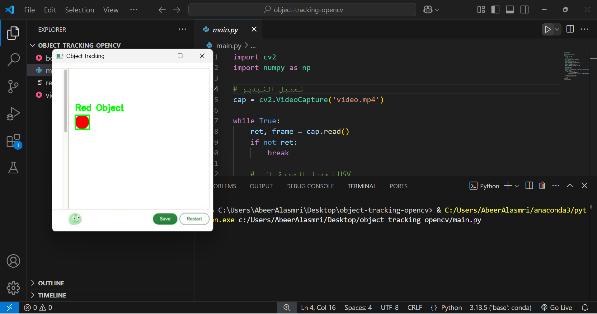

# 🎯 Body Tracking Using OpenCV

## 🧠 Track:
Artificial Intelligence and Robot Operating Systems (ROS)

---

## 🛠 Tools & Technologies Used:
- Python (programming language)  
- OpenCV, NumPy (libraries)  
- Visual Studio Code  
- Anaconda (for managing environments and running the project)  
- GitHub (for project hosting and version control)

---

## 💡 Project Idea:
This project tracks the movement of a specific object using a webcam (or video input) and draws a circle at the center of the moving object. It demonstrates the system's ability to perform real-time object tracking using OpenCV.

---

## 🎯 Project Goals:
- Learn how to use the OpenCV library for object tracking.  
- Build a hands-on project as part of the AI and ROS track.  
- Practice video analysis and real-time frame processing.  
- Get familiar with Python AI libraries.

---

## 📌 Task Description:
The program loads a video that contains a red circle moving automatically. It uses OpenCV to analyze each frame and detect the position of the circle in real-time. Then it draws a green rectangle around the circle and keeps tracking it throughout the video.

---

## 📁 Included Files:

| File Name               | Description                                               |
|-------------------------|-----------------------------------------------------------|
| main.py               | Main Python script that contains the object tracking logic. |
| video.mp4             | Sample video with a moving red circle used for tracking.  |
| requirements.txt      | List of required libraries to run the project.            |
| README.md             | This file, with full project explanation.                 |
| demo_output.png       | Screenshot showing the output of the project.             |
| body-tracking-demo.mp4| Final demo video showing the tracking results.            |

---

## ▶️ How to Run the Project:

### 🟣 Method 1 (Simplified via Anaconda + VS Code):

1. Open Anaconda Navigator.  
2. In the interface, under the base (root) environment, click the arrow and choose Open Terminal.  
3. Type the following command to install the required libraries:  
   ```bash
   pip install opencv-python numpy

4. Go back to Anaconda Navigator and open Visual Studio Code from the interface.  
5. Open the project folder, then run the file main.py by clicking the Run button or pressing:  
   Ctrl + Alt + N

---

### 🟢 Method 2 (Using `requirements.txt`):

1. Open the terminal inside the project folder.  
2. Type the following command:  
   ```bash
   pip install -r requirements.txt

3. After installation, run the file main.py using one of the following methods:

   - Click the Run button at the top-right corner of VS Code  
     *(If it's not visible, make sure the "Code Runner" extension is installed)*  
   - Or press Ctrl + Alt + N after selecting the file  
     *(Requires the "Code Runner" extension as well)*  
   - Or manually run it in the terminal using:   
```Bash
python main.py
```

---

## 🎥 Videos & Screenshots

📽️ Input Video Used in the Project:  
[🎞️ Click to open `video.mp4`](./video.mp4)

🎯 Demo Video of Tracking Output:  
[📎 Watch `body-tracking-demo.mp4`](./body-tracking-demo.mp4)

📸 Screenshot of the Project Output:  


---

## 💬 Additional Notes

- No need to use a live webcam, as the project uses a pre-recorded video (`video.mp4`).  
- It’s recommended to run the project within an Anaconda environment to avoid compatibility issues.  
- The project was tested on Python 3.10, but it should also work on versions like 3.8 or 3.11.

